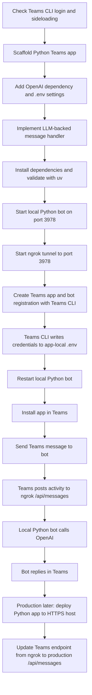
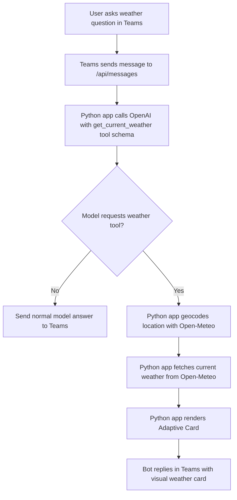
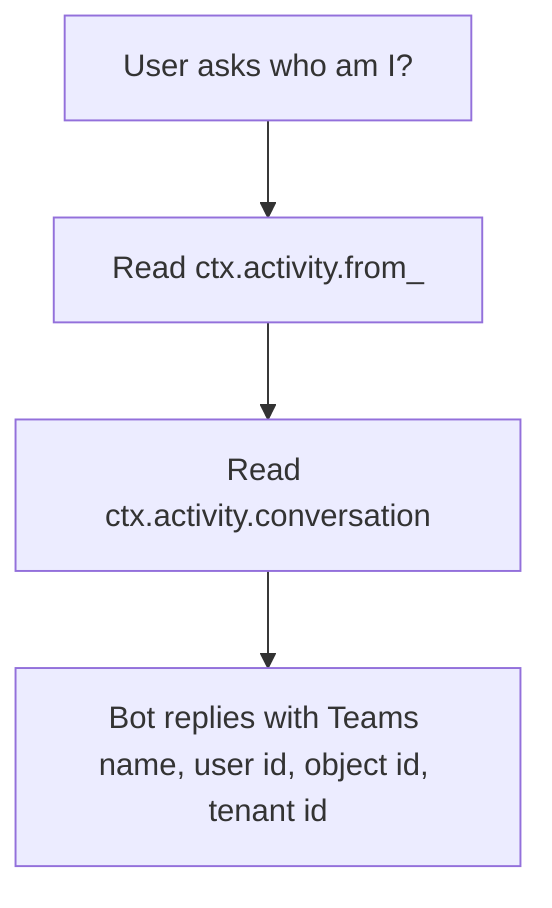
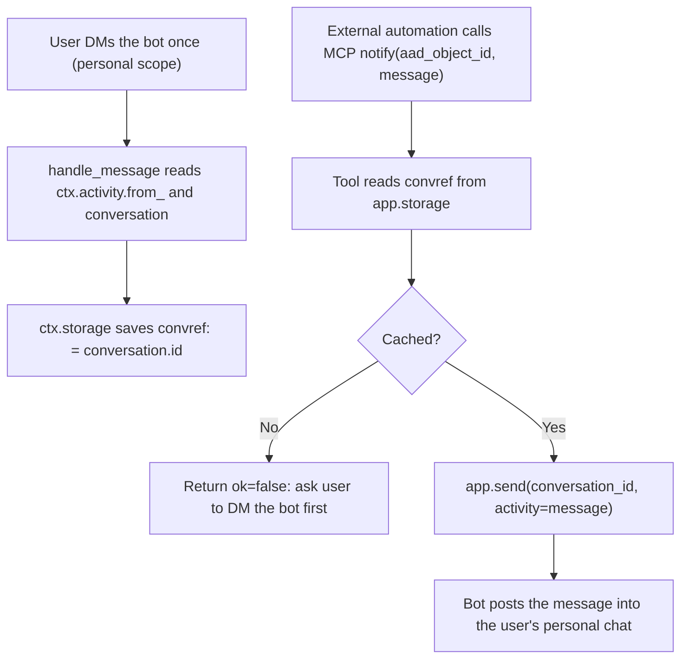

# Validated Teams Python LLM App Setup

This document records a known-working local development flow for a Microsoft Teams Python app that calls an LLM, uses an Open-Meteo weather tool, and renders weather results as Adaptive Cards.

## What This Setup Validates

- Teams CLI authentication and sideloading are available for the current Microsoft 365 tenant.
- Azure CLI is connected to a subscription in the same tenant.
- The Teams CLI can create the Teams app and register the bot.
- The Python app runs locally on port `3978`.
- ngrok is used as the public HTTPS tunnel for local development.
- Teams credentials are written to the app-local `.env`.

## Important Concept

You do not need to manually deploy or create an Azure Bot Service resource for this local hello-world flow.

The Teams CLI creates the Teams app and bot registration. Your Python code still needs to run somewhere:

- Local development: run the Python app on your laptop and expose it with ngrok.
- Production: deploy the Python app to a public HTTPS host, such as Azure App Service or Azure Container Apps, then update the Teams endpoint.

The generated app package is tenant/app-registration specific. A package downloaded from one tenant is useful for distributing that specific app inside that tenant. For production or cross-tenant distribution, use stable hosting and a proper single-tenant or multi-tenant app registration strategy.

## Flowchart



## Weather Tool Flow

The app exposes a `get_current_weather` tool to the LLM. The tool uses Open-Meteo and does not require a weather API key for this hello-world setup. Successful weather lookups are rendered as an Adaptive Card instead of plain text.



## Identity Flow

The app answers "who am I?" from the Teams activity metadata. This does not require Microsoft Graph because Teams already sends basic sender identity metadata with each incoming activity.



## Teams AI Response Enhancements

Text replies use Teams-native AI metadata and suggested prompts:

- `MessageActivityInput().add_ai_generated()` marks the response as AI-generated in Teams.
- `with_suggested_actions(...)` adds one-click prompt chips below the reply.

Current suggested prompts:

```text
Weather in Paris
Who am I?
Explain this bot
```

Suggested prompt chips use `CardActionType.IM_BACK`, so selecting one sends the prompt text back through the normal `on_message` handler.

## Proactive Notifications via MCP

The bot embeds an MCP (Model Context Protocol) server in the same process as the Teams bot, so external automations can send proactive messages into Teams without first receiving an inbound activity. The MCP server exposes a `notify(aad_object_id, message)` tool that looks up a cached personal-chat conversation id and posts to it through the bot's adapter.

A user must DM the bot at least once in personal scope before they are notifiable. On every personal-scope inbound activity, the bot caches `aad_object_id` → `conversation.id` under the storage key `convref:<aad_object_id>`. The `notify` tool reads that cache and calls `app.send(conversation_id=..., activity=message)`.



Key wiring:

- `mcp = FastMCP("hello-llm-agent")` from `mcp.server.fastmcp`.
- Two tools registered with `@mcp.tool()`: `notify(aad_object_id, message)` for sending, and `list_known_users()` to enumerate cached ids during testing.
- The bot's default adapter is `FastAPIAdapter`. In `main()`, after `app.initialize()` and before `app.start()`, the MCP server's `streamable_http_app()` is mounted on the same FastAPI app via `adapter.app.mount("/", mcp_http_app)` and its lifespan is appended to `adapter.lifespans`. The MCP endpoint is then reachable at `https://<your-host>/mcp`, sharing host and port with `/api/messages`.

For demo / local development the cache lives in `LocalStorage` (in-process, wipes on restart). For production, swap the app's storage for a durable `Storage` subclass — the handler and the MCP tool code do not change.

Resolving an email such as `admin@<your-tenant>` to an `aad_object_id` is a single Microsoft Graph call (`GET /users/<upn>?$select=id`) on the calling side. Cache the result, or expose a sibling MCP tool to do the resolution in-server.

Test by pointing the [MCP Inspector](https://github.com/modelcontextprotocol/inspector) at `https://<your-ngrok-domain>/mcp`, listing tools, and calling `notify` with a captured `aad_object_id` and a message.

## 1. Check Teams CLI Status

From any folder:

```bash
npx @microsoft/teams.cli@preview status
```

Expected shape:

```text
Logged in as <microsoft-365-user>
Sideloading: enabled
Azure CLI: connected
Subscription: <subscription-name> (<subscription-id>)
Tenant: matches Teams login
```

If not logged in, use:

```bash
npx @microsoft/teams.cli@preview login --device-code
```

## 2. Scaffold the Python Teams App

From the repo root:

```bash
npx @microsoft/teams.cli@preview project new python hello-llm-agent --template echo
```

This creates:

```text
hello-llm-agent/
  README.md
  pyproject.toml
  src/main.py
```

Note: the generated README may mention an app package folder, but the preview scaffold used for this validation did not create one. The package can be downloaded later after app registration.

## 3. Add LLM and HTTP Dependencies

In `hello-llm-agent/pyproject.toml`, include:

```toml
dependencies = [
  "dotenv>=0.9.9",
  "httpx>=0.28.0",
  "mcp>=1.27.0",
  "microsoft-teams-apps",
  "openai>=2.0.0"
]
```

`mcp` is required for the proactive notification flow described in [Proactive Notifications via MCP](#proactive-notifications-via-mcp).

## 4. Add App-Local Environment Settings

Create:

```text
hello-llm-agent/.env
```

At minimum it needs:

```bash
OPENAI_API_KEY=<your-openai-api-key>
OPENAI_MODEL=<model-name>
```

After `teams app create`, the Teams CLI also writes Teams credentials into this same `.env`, including values such as:

```bash
CLIENT_ID=...
CLIENT_SECRET=...
TENANT_ID=...
```

Do not commit `.env`.

## 5. Implement the LLM Handler and Weather Tool

The app uses:

- `src/main.py` for Teams message handling and OpenAI tool orchestration.
- `src/weather.py` for Open-Meteo geocoding and weather lookup.
- `src/weather_card.py` for the Adaptive Card weather response.
- `ctx.activity.from_` and `ctx.activity.conversation` for the no-auth "who am I?" route.

The environment loader reads the repo-root `.env` first, then app-local `.env` with override:

```python
APP_DIR = Path(__file__).resolve().parents[1]
REPO_DIR = APP_DIR.parent

load_dotenv(REPO_DIR / ".env")
load_dotenv(APP_DIR / ".env", override=True)
```

## 6. Install and Validate with uv

From the app folder:

```bash
cd hello-llm-agent
uv sync
uv run python -m compileall src
uv run python -c "import src.main; print('import ok')"
uv run pyright
```

Expected result:

```text
import ok
0 errors, 0 warnings, 0 informations
```

## 7. Start the Local Bot

From the app folder:

```bash
uv run python src/main.py
```

The app listens locally on port `3978`.

Keep this process running.

## 8. Start ngrok

In a separate terminal:

```bash
ngrok http 3978
```

ngrok prints a public HTTPS forwarding URL:

```text
https://<your-ngrok-domain>
```

The Teams messaging endpoint is:

```text
https://<your-ngrok-domain>/api/messages
```

## 9. Create/Register the Teams App

From the app folder:

```bash
npx @microsoft/teams.cli@preview app create \
  --name hello-llm-agent \
  --endpoint https://<your-ngrok-domain>/api/messages \
  --env .env
```

Expected result:

```text
App created successfully!
Name: hello-llm-agent
Teams App ID: <teams-app-id>
Bot ID: <bot-id>
Endpoint: https://<your-ngrok-domain>/api/messages
Credentials written to .env
```

The command also prints an install link and a Developer Portal link.

## 10. Restart After Registration

Important: if the Python bot was already running before `teams app create`, restart it.

Why: `teams app create` writes Teams credentials into `.env`, but the Python process only reads `.env` at startup.

Stop the running app with `Ctrl+C`, then restart:

```bash
uv run python src/main.py
```

Keep ngrok running.

## 11. Install and Test in Teams

Open the install link printed by `teams app create`, add the app in Teams, then send it a message.

If the local app logs show `POST /api/messages HTTP/1.1" 500 Internal Server Error`, first restart the Python app so it picks up the Teams credentials written to `.env`.

## 12. Enable Copilot Scope

To make the app available in Copilot surfaces supported by the Teams app manifest, update the app scopes:

```bash
npx @microsoft/teams.cli@preview app update \
  <teams-app-id> \
  --scopes personal,team,copilot
```

Validated output shape:

```text
Scopes updated: personal, team, copilot
Version auto-bumped: <old-version> → <new-version> — reinstall may be needed
```

Get the install link again:

```bash
npx @microsoft/teams.cli@preview app get \
  <teams-app-id> \
  --install-link
```

Because the app version is auto-bumped, reinstalling or updating the app in Teams may be required before the new scope is visible.

## 13. Add a Static Personal Tab

The Python SDK can serve static pages from the bot server. Register a local folder as a tab:

```python
app.tab("about", str(APP_DIR / "static" / "about"))
```

With an `index.html` file at:

```text
hello-llm-agent/static/about/index.html
```

The page is served at:

```text
https://<your-host>/tabs/about/
```

For local ngrok testing:

```text
https://<your-ngrok-domain>/tabs/about/
```

To expose the page as a personal Teams tab, download and edit the Teams manifest:

```bash
npx @microsoft/teams.cli@preview app manifest download \
  <teams-app-id> \
  .teams/manifest.current.json
```

Add a custom static tab:

```json
{
  "entityId": "homeTab",
  "name": "Home",
  "contentUrl": "https://<your-ngrok-domain>/tabs/about/",
  "websiteUrl": "https://<your-ngrok-domain>/tabs/about/",
  "scopes": ["personal"]
}
```

Keep the reserved bot chat tab if you want to control tab ordering:

```json
{
  "entityId": "conversations",
  "scopes": ["personal"]
}
```

Important: `about` and `conversations` are reserved `staticTabs[].entityId` values. Reserved tabs must not specify a `name` property. For a custom tab with a display name, use a non-reserved `entityId`, such as `homeTab`.

Bump the manifest version, then upload it:

```bash
npx @microsoft/teams.cli@preview app manifest upload \
  .teams/manifest.current.json \
  <teams-app-id>
```

Validated result:

```text
Manifest uploaded
```

Reinstalling or updating the app in Teams may be required before the tab appears.

## 14. Download an App Package for an Admin

The Teams CLI can download a Teams app package ZIP for the registered app:

```bash
cd hello-llm-agent
npx @microsoft/teams.cli@preview app package download \
  <teams-app-id> \
  --output hello-llm-agent.zip
```

Expected package contents:

```text
manifest.json
color.png
outline.png
```

The manifest includes the app id, bot id, and valid domains for the registered app. With local development, that usually includes your current ngrok domain.

This package is suitable for local/demo validation in the current tenant. For production or a real admin handoff, first deploy the Python service to a stable HTTPS host, update the Teams app endpoint/domain, and then download a fresh package. Do not commit generated app package ZIP files unless you intentionally want to publish that tenant-specific artifact.

## Production Path

For production, replace ngrok with a stable deployment:

1. Deploy the Python app to Azure App Service, Azure Container Apps, or another HTTPS host.
2. Set environment variables on that host:
   - `OPENAI_API_KEY`
   - `OPENAI_MODEL`
   - `CLIENT_ID`
   - `CLIENT_SECRET`
   - `TENANT_ID`
3. Update the Teams app/bot endpoint from the ngrok URL to:

   ```text
   https://<production-host>/api/messages
   ```

Manual Azure Bot Service deployment is not required for this validated hello-world flow unless a later scenario specifically needs Azure Bot Service features or enterprise policy controls.

## Next Steps and Remarks: Message History

Teams-visible chat history is not the same thing as bot memory.

Teams keeps rendering previous messages in the Teams client because Teams owns the chat transcript. The Python service only receives new incoming activities posted to `/api/messages`. If the service restarts, it does not automatically receive or reconstruct the previous chat transcript.

For LLM memory, the app needs its own store:

```text
incoming Teams activity
  -> derive memory key from Teams metadata
  -> load recent conversation messages from app storage
  -> call the LLM with that context
  -> store the new user message and bot response
```

Different users and conversations are distinguished from the incoming Teams activity payload:

- User identity: `ctx.activity.from_`
- Conversation identity: `ctx.activity.conversation`
- Tenant/team/channel context, when available: `ctx.activity.channel_data`

Recommended first memory key:

```text
tenant_id + conversation_id
```

For user-specific preferences, add the user id:

```text
tenant_id + conversation_id + user_id
```

Typical scopes:

- Personal chat: one user and one bot; conversation memory can be keyed by `conversation.id`.
- Group chat: multiple users share one conversation; shared chat history should be keyed by `conversation.id`, with per-user preferences keyed by `from_.id`.
- Channel: use the conversation plus Teams-specific channel/team metadata from `channelData` when available.

Storage options:

- Local development: SQLite or a local JSON file.
- Production: Cosmos DB, PostgreSQL, Redis, Azure Table Storage, or another durable store.

Useful docs:

- Send and receive Teams bot messages: <https://learn.microsoft.com/en-us/microsoftteams/platform/bots/build-conversational-capability>
- Create a Teams conversation bot: <https://learn.microsoft.com/en-us/microsoftteams/platform/sbs-teams-conversation-bot>
- Teams bot concepts and activity handlers: <https://learn.microsoft.com/en-us/microsoftteams/platform/bots/bot-concepts>
- Teams bots overview: <https://learn.microsoft.com/en-us/microsoftteams/platform/bots/overview>
- Teams SDK memory protocol API: <https://learn.microsoft.com/en-us/python/api/microsoft-teams-ai/microsoft.teams.ai.memory.memory?view=msteams-sdk-python-latest>
